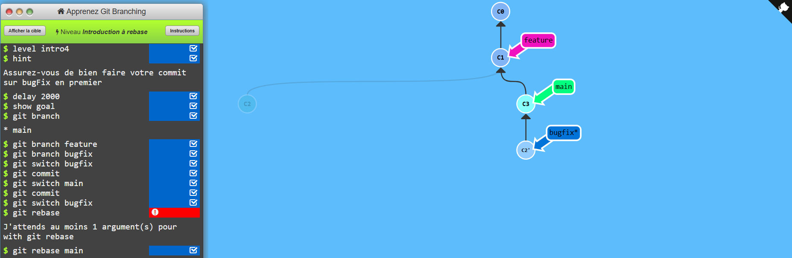

# TP4
### 3.
je pense pas qu'il y aura de commit de fusion car le main n'as pas avancer

Résultat:
````
Ethan@DESKTOP-N7IV693 MINGW64 /d/GitHub/tp-02-zones-git/merge-lab (main)
$ git lg
* b42b00a (HEAD -> main, feature-a) First Commit dans la branch feature
* 9c112c3 First Commit
* f508dae First Commit
````
Comme l'hypotèse l'avais pronocer il n'y a aucun commit de fusion

Alerte ne pas faire attention au deux premier commit car dans le tout premier je n'avais rien ecrit dans le fichier.txt .

### 4.

Git n'a pas créer de commit de fusion car le branch n'a pas d'avancement depui la création de la branch

### 6.

le commit de fusion à deux parent la branch main et la branch feature-b

le Résultat de la commande git cat-file -p HEAD | grep parent:
````
Ethan@DESKTOP-N7IV693 MINGW64 /d/GitHub/tp-02-zones-git/merge-lab (main)
$ git cat-file -p HEAD | grep parent
parent 34645eb372c9dfcce05086b794b52bd2b41e4a35
parent 69a843db2846854ef1fc043285ef28b19fcb990e
````

### 7.
Resultat du git lg
````
Ethan@DESKTOP-N7IV693 MINGW64 /d/GitHub/tp-02-zones-git/merge-lab (main)
$ git lg
*   3e0c6fb (HEAD -> main) Merge branch 'feature-b'
|\  
| * 69a843d (feature-b) First Commit dans la branch feature-b
* | 34645eb 2 commit sur main
|/  
* b42b00a (feature-a) First Commit dans la branch feature
* 9c112c3 First Commit
````

### 9.
Etat du fichier lors du conflit
````txt
1 commentaire
2 commentaire
3 commentaire
4 commentaire
5 commentaire
6 commentaire
<<<<<<< HEAD
8 commentaire
=======
7 commentaire
>>>>>>> feature

````
le code d'erreur de git 
````bash
Ethan@DESKTOP-N7IV693 MINGW64 /d/GitHub/tp-02-zones-git/merge-lab (main)
$ git merge feature
Auto-merging fichier.txt
CONFLICT (content): Merge conflict in fichier.txt
Automatic merge failed; fix conflicts and then commit the result.
````

### 10.

Pour terminer une fusion apres avoir résolue le conflit il faut faire un git add puis faire git commit si on oublie le git add git nous renvoie cette erreur:
````bash
Ethan@DESKTOP-N7IV693 MINGW64 /d/GitHub/tp-02-zones-git/merge-lab (main|MERGING)
$ git commit
U       fichier.txt
error: Committing is not possible because you have unmerged files.
hint: Fix them up in the work tree, and then use 'git add/rm <file>'
hint: as appropriate to mark resolution and make a commit.
fatal: Exiting because of an unresolved conflict.
````

### 11.
voici le commit de fusion et c'est parent

````
*   8b8ec2f (HEAD -> main) Merge branch 'feature'
|\  
| * 2fc8b9d (feature) Premier commit feature-c
* | 9b37b75 3 commit main
|/  
*   3e0c6fb Merge branch 'feature-b'
````

### 12.


le rebase permet d'ajouter la branch bugfix dans la branch main comme si aucune n'avais été créer

# TP5

### 3.

Résultat git remote -v
```` bash 
origin  git@github.com:Ethan040723/demo-git-ethan.git (fetch)
origin  git@github.com:Ethan040723/demo-git-ethan.git (push)
````

Résultat git branch -vv
````bash
$ git branch -vv
  feature   2fc8b9d Premier commit feature-c
  feature-a b42b00a First Commit dans la branch feature
  feature-b 69a843d First Commit dans la branch feature-b
* main      3aa3949 Rajout de tout le 
````

origin/main montre la branche main en commun entre le repository et mon git local

### 4.

le ssh demande un fichier avec une clef ssh à l'intérieur 

le https ne demande aucune connexion

### 7.

Je pense que git vas créer un commit de fusion

Résultat :
````bash
Ethan@DESKTOP-N7IV693 MINGW64 /d/GitHub/tp-02-zones-git/merge-lab (main)
$ git log --graph
* commit c23eeba2c564a164bdf285e02ba54506f4346da6 (HEAD -> main, origin/main, origin/HEAD)
| Author: Ethan040723 <ethan.quehelecozler@gmail.com>
| Date:   Wed Sep 30 14:59:49 2026 +0200
| 
|     Fix header formatting in README.md
| 
* commit ee9c3faa63ad15851fd8ea811e4762296feea3d4
````

Comme on peut voir il à fait un fast-forward. C'est différent car en réaliter la branch main en local car les deux branchs sont la même branche car elle sont lié.

### 8. 
Résultat apres le git fetch :
````bash
Ethan@DESKTOP-N7IV693 MINGW64 /d/GitHub/tp-02-zones-git/merge-lab (main)
$ git log --oneline --all --graph
* c23eeba (HEAD -> main, origin/main, origin/HEAD) Fix header formatting in README.md
* ee9c3fa Ajout du README.md
* 2a224de Ajout du README.md
* 2496ba5 Rajout de tout le tp4 modifier
* 3aa3949 (feature-test) Rajout de tout le tp4
*   8b8ec2f Merge branch 'feature'
|\  
| * 2fc8b9d (feature) Premier commit feature-c
* | 9b37b75 3 commit main
|/  
*   3e0c6fb Merge branch 'feature-b'
|\  
| * 69a843d (feature-b) First Commit dans la branch feature-b
* | 34645eb 2 commit sur main
|/  
* b42b00a (feature-a) First Commit dans la branch feature
* 9c112c3 First Commit
* f508dae First Commit 
````

### 10.